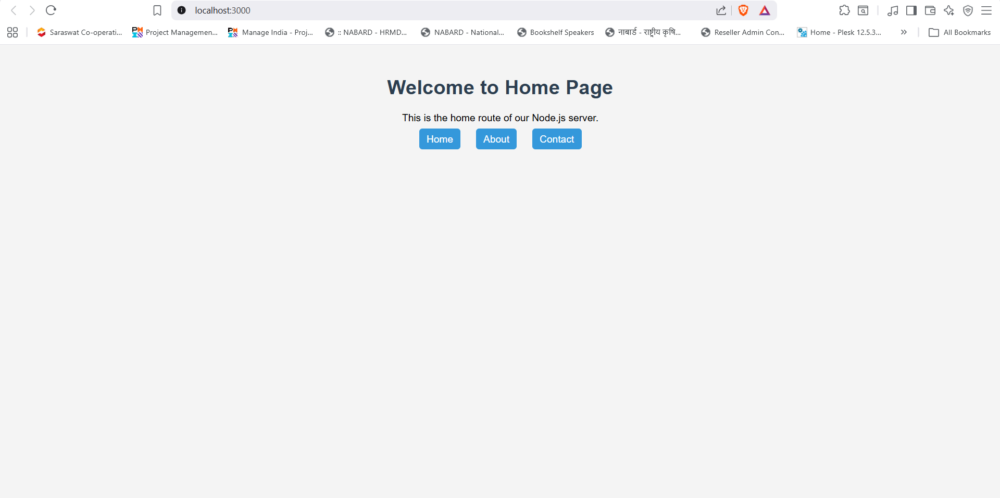
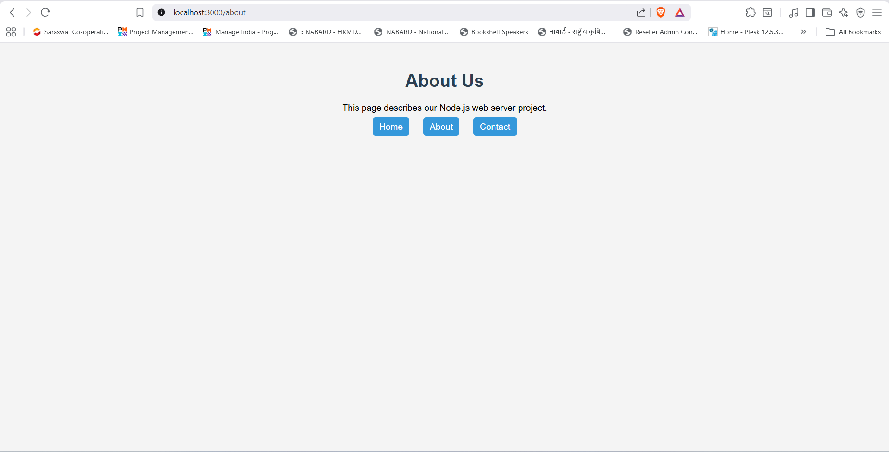
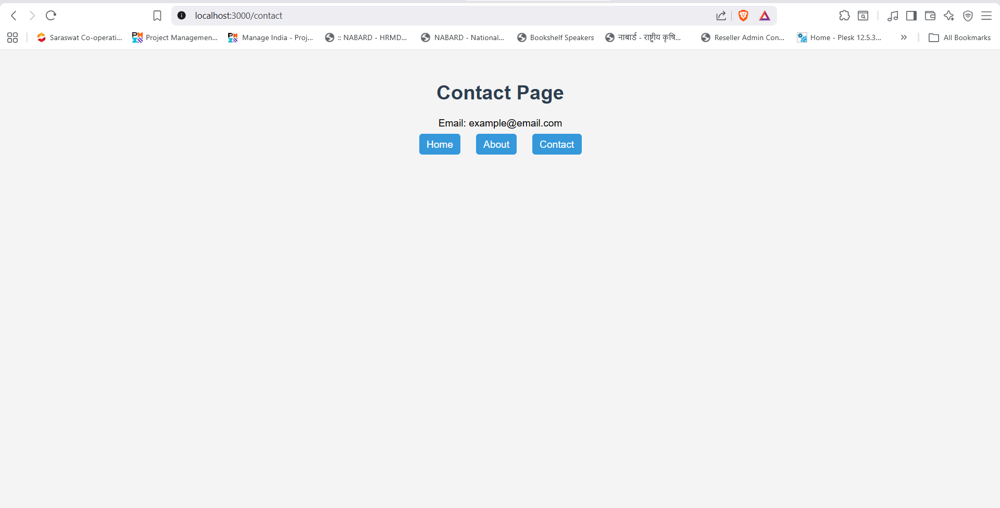

## How It Works

### 1. The Entry Point - app.js
- This is where the server starts
- It creates an HTTP server and listens on port 3000
- When someone visits the website, app.js sends the request to routes.js

### 2. The Router - routes.js
- It looks at the URL (like `/about` or `/contact`)
- It decides which HTML file to show based on the URL
- It also handles the CSS file (style.css)

### 3. The File Handler - utils/fileHandler.js
- This is a helper that reads files from my computer
- It reads HTML or CSS files and sends them to the browser
- If the file is found, it shows the page
- If there's an error, it shows a 500 error message

### 4. The Pages - pages/ folder
- **home.html** - The main/home page (shown at `/`)
- **about.html** - The about page (shown at `/about`)
- **contact.html** - The contact page (shown at `/contact`)
- **404.html** - Shown when someone visits a page that doesn't exist

### 5. The Styles - public/style.css
- This file makes the pages look nice
- It's loaded by all HTML pages

## 6. Screenshots

### Home Page

### About Page

### Contact Page

### 404 Page

